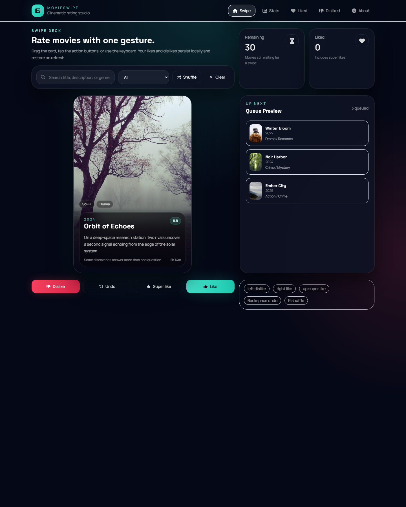
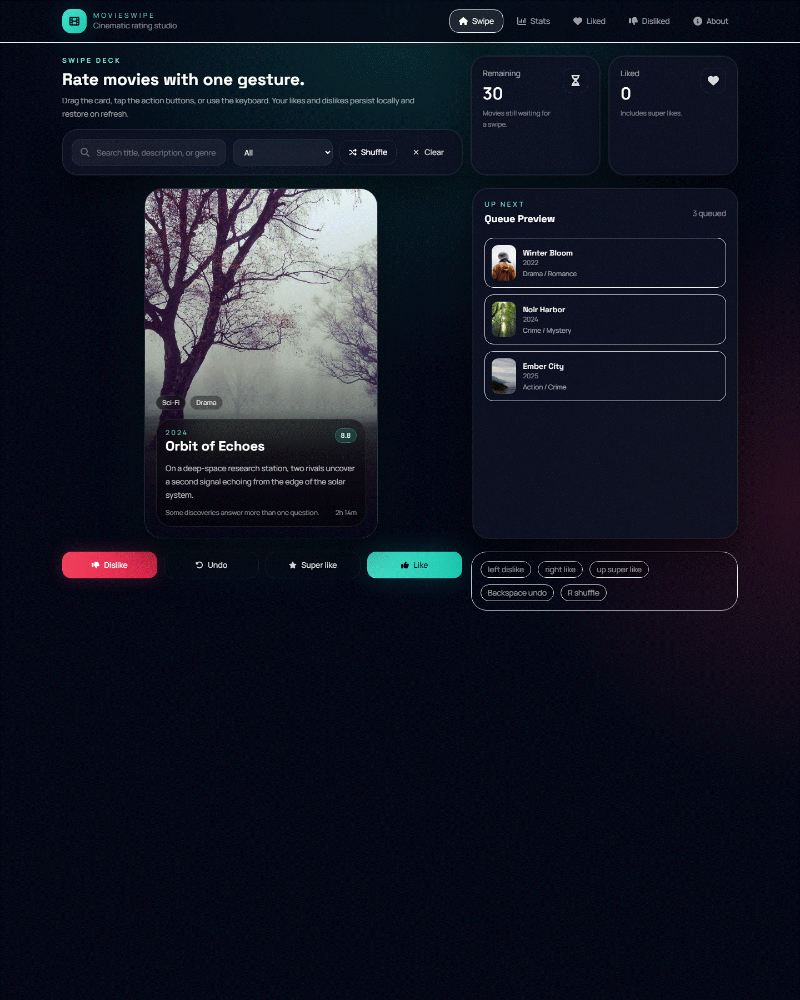

# MovieSwipe

MovieSwipe is a production-style static frontend for rating movies with Tinder-like swipe interactions.

## Showcase





## Stack

- React
- Vite
- TypeScript
- TailwindCSS
- Framer Motion
- React Icons
- Zustand

## Features

- Swipe right to like
- Swipe left to dislike
- Super-like action
- Undo last swipe
- Keyboard support
- Search and genre filtering
- Persistent local state in `localStorage`
- Statistics dashboard with charts and history
- Favorites and disliked movie libraries
- Mobile-first dark glassmorphism UI

## Project Structure

- `src/components/` reusable UI and movie-specific components
- `src/pages/` route-level pages
- `src/hooks/` shared interaction and derived-state hooks
- `src/services/` movie data abstraction
- `src/store/` Zustand state and persistence
- `src/utils/` helpers and statistics logic
- `src/types/` shared TypeScript types
- `src/data/` mock JSON library

## Getting Started

```bash
npm install
npm run dev
```

## Available Scripts

- `npm run dev` starts the Vite dev server
- `npm run build` creates the production build
- `npm run preview` previews the production build locally
- `npm run lint` runs ESLint
- `npm run format` writes Prettier formatting
- `npm run format:check` checks formatting

## Deployment

The repository includes a GitHub Actions workflow at `.github/workflows/deploy.yml` that:

1. Installs dependencies
2. Builds the project
3. Publishes `dist/` to GitHub Pages

The app uses `HashRouter`, so it works correctly on GitHub Pages without extra rewrite rules.

## Architecture Notes

The app is organized to make a future TMDB integration straightforward:

- `loadMovieLibrary()` currently reads from local mock JSON
- the Zustand store owns ratings, history, filters, and queue order
- the UI reads from hooks that derive visible cards and statistics
- components are intentionally small and reusable so page-level views stay thin

## State Persistence

Likes, dislikes, filters, deck order, and swipe history are restored from `localStorage` after refresh. Duplicate ratings are ignored, and the last swipe can be undone.
